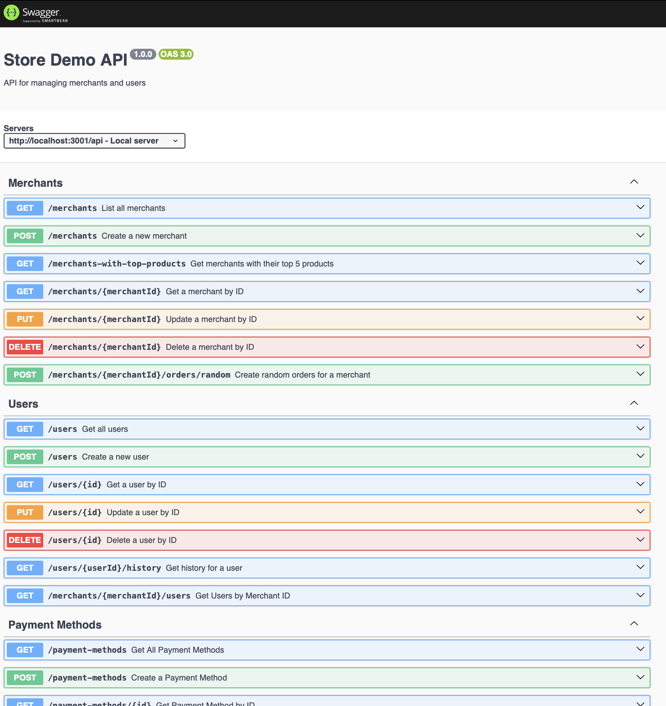

# express / postgres / typescript demo

This is a demo using express+swagger+typescript, postgres, nextjs+typescript+tailwind, and jupyter labs to enable panda style querying of the data.  The data is fake and in general I've included useful ChatGPT responses where relevant.   

Credits...
- ChatGPT 3.5 and 4.0 for many code ideas
- Dalle-3 for image generation

1. First, update Homebrew to the latest version:

```
brew update
```

2. Install PostgreSQL with Homebrew:

```
brew install postgresql
```

3. Once the installation is complete, you can start the PostgreSQL service:

```
brew services start postgresql
```

4. To create a new database and start using PostgreSQL, you can use the `createdb` command:

```
createdb store_demo
```

5. Create tables and load mock data

```
cd db
psql store_demo < create_tables.sql
cd ..
```

6. Install npm packages

```bash
cd express
npm install
```

If npm isn't installed, you can install nvm using homebrew using guide from [here](https://collabnix.com/how-to-install-and-configure-nvm-on-mac-os/)

```bash
brew install nvm
source $(brew --prefix nvm)/nvm.sh
nvm install node
```

7.  Start express

```bash
npm run start
```

If all is good, check out http://localhost:3000/api-docs !

Sometimes, it gives me a blank screen when on Safari, but Chrome seems to consistently work




# Jupyter Lab to explore data

Create a virtual environment
```bash
python3 -m venv venv
```

Activate the environment
```bash
source venv/bin/activate
```

Install packages (requirements has commonly used packages)
```bash
pip install -r requirements.txt
```

Start Jupyter Labs
```bash
jupyter lab --notebook-dir=notebooks
```

Deactivate
```bash
deactivate
```